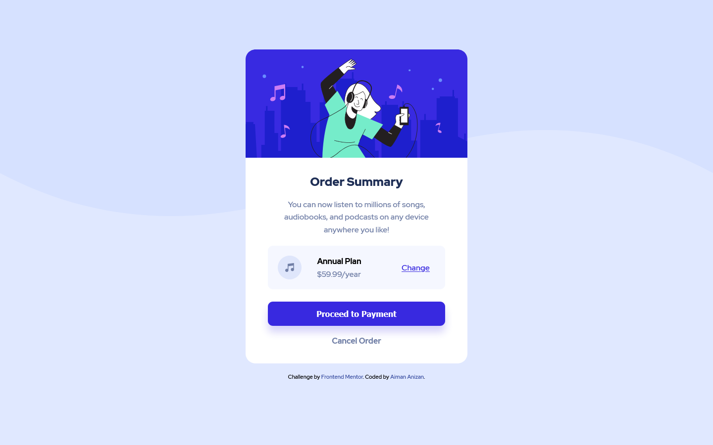

# Frontend Mentor - Order summary card solution

This is a solution to the [Order summary card challenge on Frontend Mentor](https://www.frontendmentor.io/challenges/order-summary-component-QlPmajDUj). Frontend Mentor challenges help you improve your coding skills by building realistic projects.

## Table of contents

-   [Overview](#overview)
    -   [The challenge](#the-challenge)
    -   [Screenshot](#screenshot)
    -   [Links](#links)
-   [My process](#my-process)
    -   [Built with](#built-with)
    -   [What I learned](#what-i-learned)
    -   [Useful resources](#useful-resources)
-   [Author](#author)

## Overview

### The challenge

Users should be able to:

-   See hover states for interactive elements

### Screenshot




### Links

-   Solution URL: [Frontend Mentor | Solution](https://www.frontendmentor.io/solutions/order-summary-card-with-sass-using-css-grid-psJz-KyCv)
-   Live Site URL: [Frontend Mentor | Order summary card](https://aimananizan56.github.io/Order-Summary-Card/)

## My process

### Built with

-   Semantic HTML5 markup
-   Gulp-SaSS-Boilerplate Template by [@thecodercoder](https://github.com/thecodercoder)
-   SaSS custom properties
-   CSS Grid
-   Mobile-first workflow

### What I learned

I had learn how the grid system works by providing template for the columns and state the value for each classes. I also find that using Mozilla Firefox is very useful when dealing with grid and flex.

```html
<div class="card__plan">
    
    <div class="card__plan-price">
        Annual Plan
        <div>$59.99/year</div>
    </div>
    <a href="#" class="card__plan-button">Change</a>
</div>
```

```scss
.card {
    &__plan {
        display: grid;
        grid-template-columns: 25% 2fr 25%;

        &-price {
            grid-column-start: 2;
            grid-column-end: 3;
        }

        &-button {
            grid-column-start: 3;
            grid-column-end: 4;
        }
    }
}
```

### Useful resources

-   [A Complete Guide to Grid | CSS-Tricks](https://css-tricks.com/snippets/css/complete-guide-grid/m) - This website provide a lot of useful tricks and tips for the newbie like me. I recomend this website for anyone who like to deep more into css grid and the others.

## Author

-   Frontend Mentor - [@aimananizan56](https://www.frontendmentor.io/profile/AimanAnizan56)
